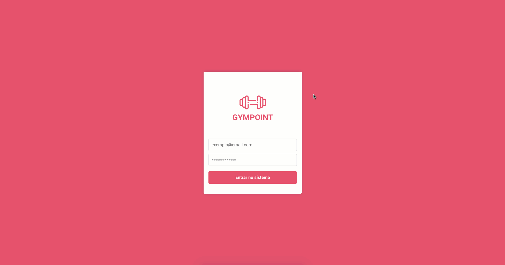
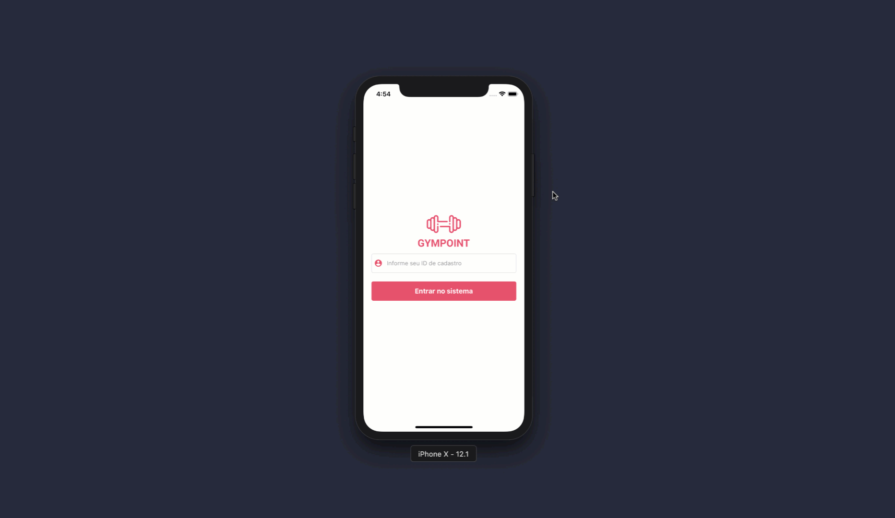

<h3 align="center">
  Projeto Gympoint
</h3>

<blockquote align="center">“Aplicação de academia utilizando a stack mais famosa do mercado, sendo o backend com node, o frontend web com react e a alicação mobile com react-native”!</blockquote>

## :rocket: Conhecendo a aplicação

A aplicação que iremos dar início ao desenvolvimento a partir de agora é um app gerenciador de academia, o **Gympoint**.

### Gympoint Web

Versão web destinada aos instrutores da academia.

# Demonstração da Interface

### Gympoint Mobile

Versão mobile destinada aos alunos da academia.

# Demonstração da Interface

